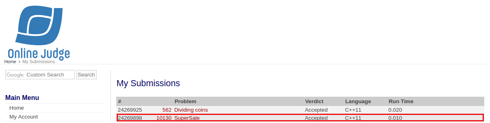

# [SuperScale](https://onlinejudge.org/external/101/10130.pdf)

## Veredito do Código



## Respostas

Gabarito dos inputs fornecidos

### [Input 01](input1.txt)

Caso de teste retirado da própria questão

```
72
514
```

### [Input 02](input2.txt)

Caso de teste retirado do [uDebug](https://www.udebug.com/UVa/10130)

```
0
435
83
646
```

### [Input 03](input3.txt)

Caso de teste retirado do [uDebug](https://www.udebug.com/UVa/10130)

```
179
1590
3998
5661
19
1770
6805
10400
4712
644
```
