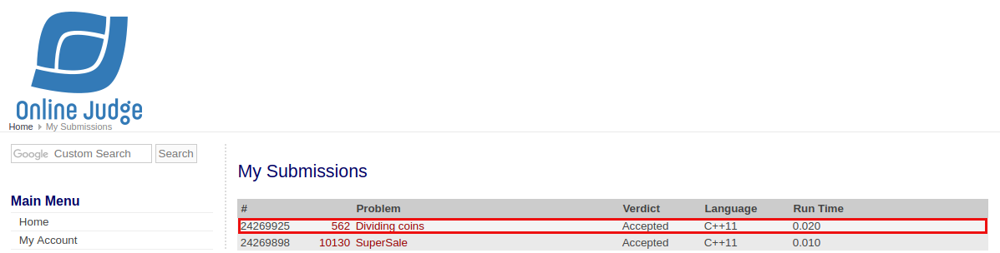

# [Dividing Coins](https://onlinejudge.org/external/5/562.pdf)

## Veredito do Código



## Respostas

Gabarito dos inputs fornecidos

### [Input 01](input1.txt)

Caso de teste retirado da própria questão

```
0
1
```

### [Input 02](input2.txt)

Caso de teste retirado do [uDebug](https://www.udebug.com/UVa/562)

```
1
0
5
0
12
0
0
10
1
0
2
```

### [Input 03](input3.txt)

Caso de teste retirado do [uDebug](https://www.udebug.com/UVa/562)

```
0
```
